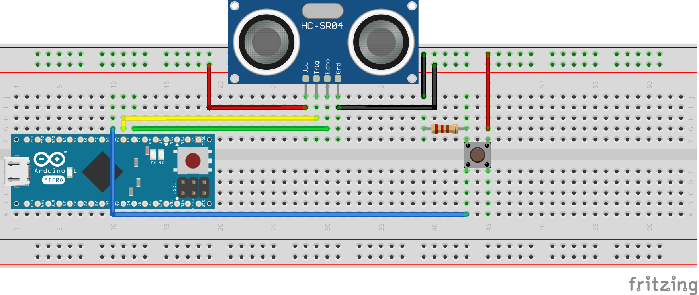

# Project template!

*Trombone controller for the Trombone Champ game.*

## Table of contents
- [Generalities](#generalities)
- [Setup](#setup)
  * [Assembly](#assembly)
  * [Code](#code)

## Generalities
To be used with the game [Trombone Champ](https://store.steampowered.com/app/1059990/Trombone_Champ/).

The mapping of the controls is done as follows:

| On the bike          | Player 1         | Effect             |
|----------------------|------------------|--------------------|
| Ultrasonic goes up   | Mouse goes up    | Trombone goes up   |
| Ultrasonic goes down | Mouse goes down  | Trombone goes down |
| Button goes click    | Mouse goes click | Trombone goes toot |

## Setup

### Assembly

> Note: The previous pic can be modified using [this](./ultrasound.fzz).

| Wire      | Goes on  |
|-----------|----------|
| VCC board | VCC line |
| GND board | GND line |
| VCC from ultrasonic | VCC line |
| GND from ultrasonic | GND line |
| Trig from ultrasonic | Arduino pin 2 |
| Echo from ultrasonic | Arduino pin 3 |
| GND from button | Resistor, into GND line |
| VCC from button | VCC line |
| VCC trigger from button | Arduino pin 4 |

### Code
Please refer to [ultrasound/ultrasound.ino](./ultrasound/ultrasound.ino).
